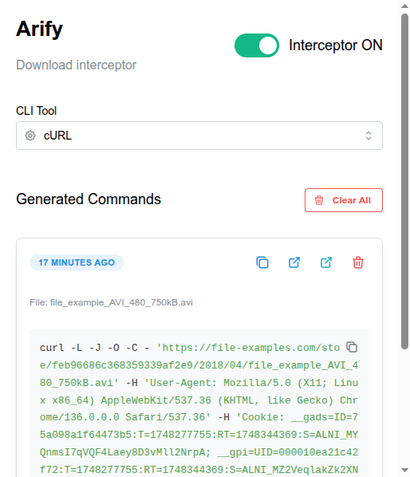
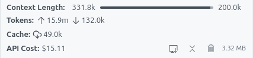

<h1 align="center">Arify</h1>

✨ Vibe-coded chrome extension for download interception

  

 

 

 

## Features

- 🛑 Prevent any request to the download url
- ⏬ Export the download url to ready to use cURL, Wget or Aria2 cli command
- 👤 Clone the referer, cookies & user-agent of the original download

 

## Installation

Ask AI.

 

## Development

### 2025-05-27

- Coding agent: Cline 3.17
- AI model: Claude sonnet 3.7
- Input tokens: 15.900.000 tokens
- Output tokens: 132.000 tokens
- Cost: $15.11
- Vibe coding duration: ~1 hour

